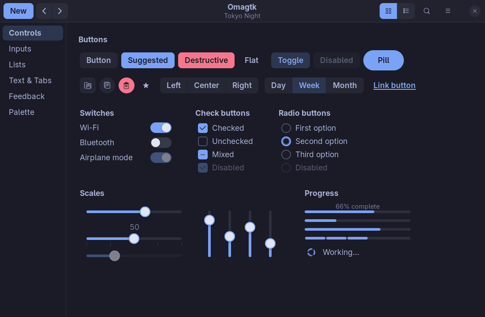
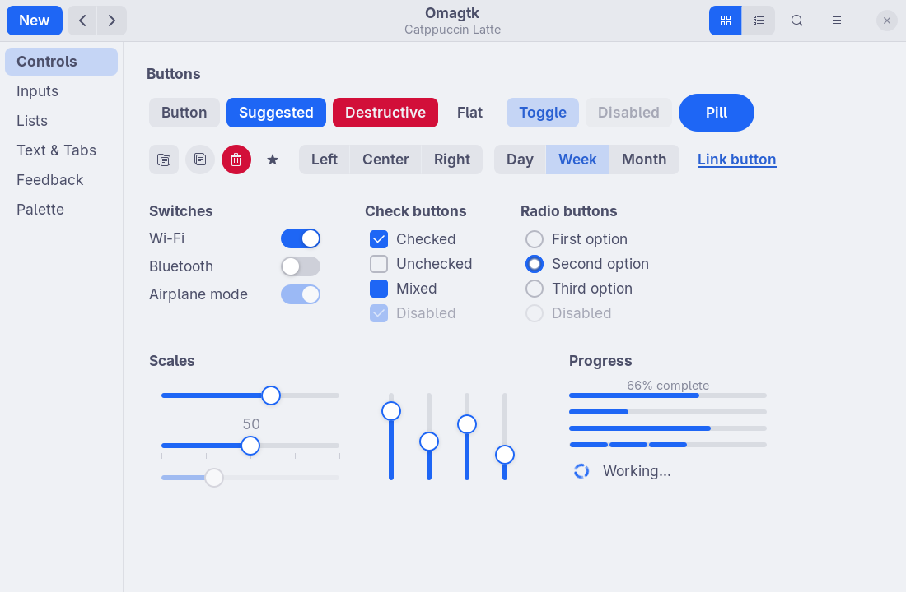
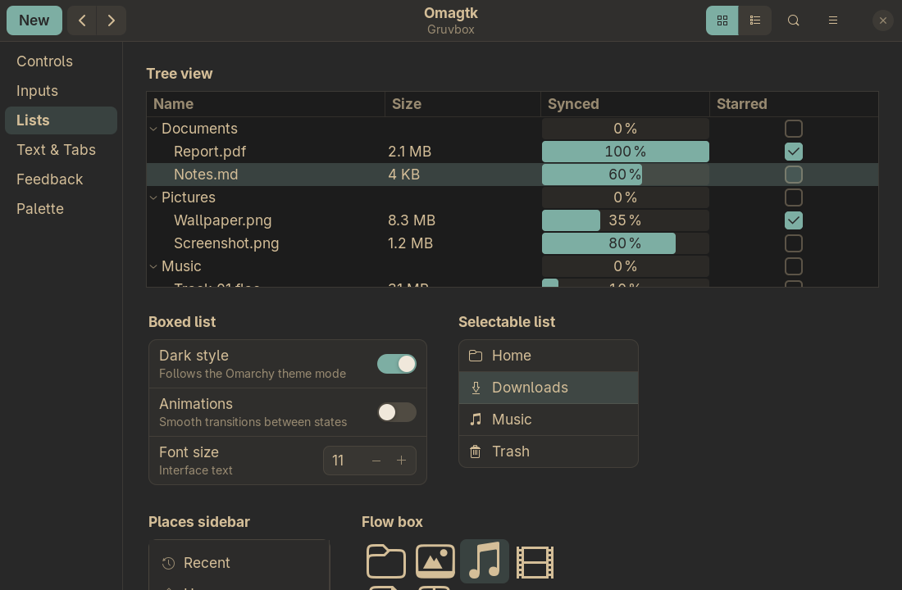
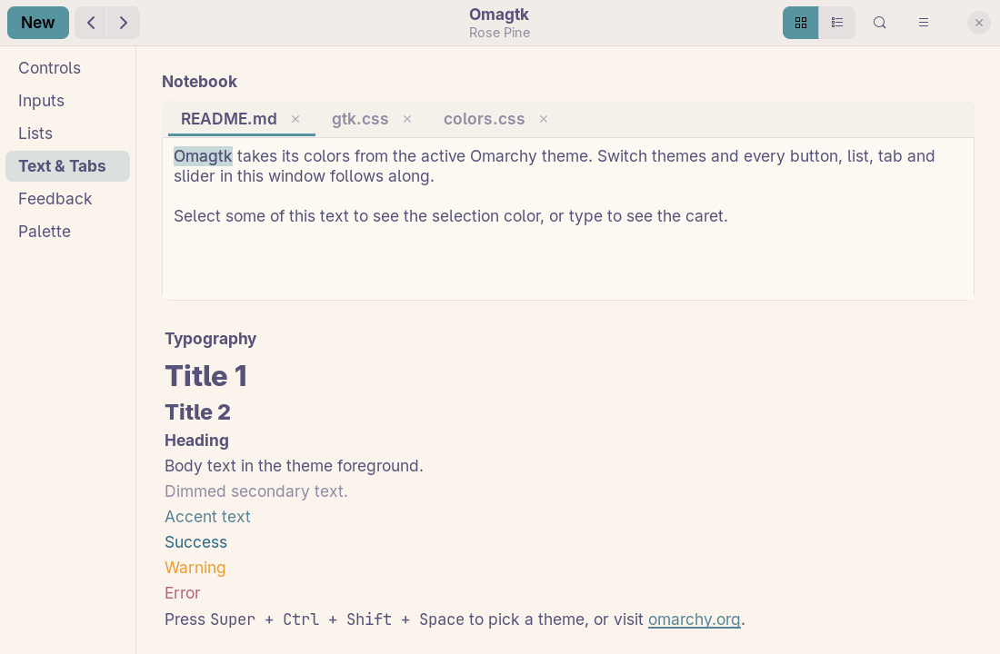
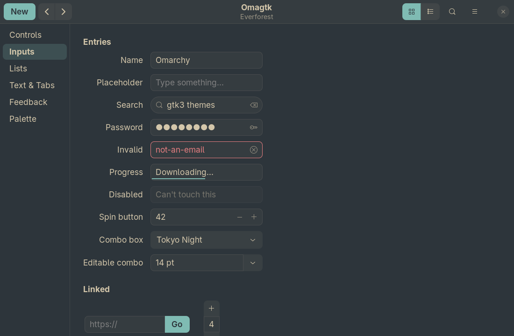

# Omagtk

A modern GTK3 theme that follows your [Omarchy](https://omarchy.org) theme.

Switch Omarchy themes and every GTK3 app recolors to match: buttons, switches,
checkboxes, sliders, tabs, lists, menus, selections, info bars, and the
symbolic icons inside them. It works with dark and light Omarchy themes, and it
leaves your icon theme alone.

<p align="center">
  
  
</p>
<p align="center">
  
  
</p>
<p align="center">
  
</p>

## Features

- **Follows Omarchy automatically.** A theme-set hook recolors it on every
  theme change, and running apps reload without a restart.
- **Written from scratch.** It is a flat, rounded, libadwaita-inspired design,
  not a recolored Adwaita. The accent color marks everything interactive.
- **One stylesheet for every palette.** It never hard-codes a color: all
  surfaces are mixed from the palette, so dark and light themes both work.
- **Readable on any accent.** Text on colored buttons is picked by WCAG
  contrast, so a pastel accent gets dark text and a deep one gets light text.
- **Leaves your icon theme alone.** Papirus, Adwaita, Yaru or anything else keeps
  working.
- **Matches tiling Hyprland.** Windows are square and shadowless, so the
  compositor's borders and gaps do the framing.

## Requirements

- [Omarchy](https://omarchy.org). Without it, Omagtk falls back to a built-in
  Tokyo Night palette.
- GTK 3.24 apps.
- `gsettings` (part of GLib), used to switch the GTK theme.

## Install

### Arch / Omarchy (recommended)

Install the package from the [latest release](https://github.com/lszl84/omagtk/releases/latest),
then set it up as your desktop user (not root):

```sh
sudo pacman -U https://github.com/lszl84/omagtk/releases/download/v0.1.0/omagtk-0.1.0-1-any.pkg.tar.zst
omagtk setup
```

That's it. Omagtk is active and will follow every Omarchy theme change from
now on. To update, install the newer release the same way, then run
`omagtk apply` to reload open apps.

Or build the package yourself from a checkout:

```sh
git clone https://github.com/lszl84/omagtk.git
cd omagtk
makepkg -si
omagtk setup
```

### Without a package

```sh
git clone https://github.com/lszl84/omagtk.git
cd omagtk
./install.sh
```

This copies everything into `~/.local` and runs `omagtk setup`.

To hack on the theme, use `./install.sh --link`. It links to your checkout
instead, so your edits apply straight away. Run `omagtk apply` to reload
open apps.

### What `omagtk setup` does

The theme's CSS is shared, but its colors are per user, so setup creates:

| What | Where |
| --- | --- |
| Your theme folder: links to the shared CSS, plus your generated `colors.css` | `~/.local/share/themes/Omagtk` |
| An Omarchy hook that runs `omagtk apply` on theme changes | `~/.config/omarchy/hooks/theme-set.d/omagtk` |

It then sets the GTK theme to Omagtk. Run `omagtk status` to check.

### Uninstall

First, as your desktop user:

```sh
omagtk remove
```

This removes the theme folder and the hook, and hands GTK back to Omarchy's
default Adwaita. Then remove the package with `sudo pacman -R omagtk`, or run
`./uninstall.sh` if you used `install.sh`.

## How it works

```
colors.toml ──omagtk apply──▶ colors.css ──@import──▶ gtk.css
 (Omarchy)                   (a few colors)          (hand-written theme)
```

[`theme/gtk-3.0/gtk.css`](theme/gtk-3.0/gtk.css) is the whole theme, written by
hand. It never names a concrete color. Instead it imports `colors.css`, a
dozen `@define-color` lines that [`omagtk apply`](bin/omagtk) generates
from `~/.local/state/omarchy/current/theme/colors.toml`:

- The theme's `background`, `foreground`, `accent`, `red`, `green`, `yellow`, …
- A readable text color for each filled surface (`accent_fg`, `red_fg`, …).
- `extreme` (black for dark themes, white for light ones) and a switch knob color.

Everything else is derived with GTK's `mix()`, `alpha()` and `shade()`:

- Content views are the background pushed toward `extreme`.
- Header bars are the background nudged toward the foreground.
- Borders and button fills are a translucent foreground.
- Selections, focus rings and toggled states are a translucent accent.

That is why a single stylesheet suits Matte Black and Catppuccin Latte alike.

GTK only rereads theme CSS when the theme *name* changes. On a theme switch,
Omarchy first resets GTK to Adwaita, and the hook then sets it back to Omagtk,
so running apps reload. When you run `omagtk apply` by hand, it does that
bounce itself.

The theme also defines the standard color names apps use in their own CSS
(`theme_selected_bg_color`, `accent_bg_color`, `window_bg_color`, …), so apps
with custom styling pick up the palette too.

## Icons

Omagtk leaves the `icon-theme` setting alone. Symbolic (monochrome) icons in
buttons, header bars, sidebars and menus are recolored by GTK from the
surrounding text color, so they follow the theme under any icon set.
Full-color icons, such as app logos and folders, keep their own look.

> [!NOTE]
> Omarchy itself sets the icon theme to the Omarchy theme's `Yaru-*` variant
> on every theme switch, in `omarchy-theme-set-gnome`. That is Omarchy's
> behavior, not Omagtk's.

## Previewing other palettes

To render the theme with any Omarchy palette without switching your desktop,
point `omagtk apply` at that palette's `colors.toml` and pass `--colors`:

```sh
OMAGTK_COLORS_TOML=/usr/share/omarchy/themes/nord/colors.toml omagtk apply --colors
```

Then run `omagtk apply` again to go back to your current theme.

## Limitations

- **GTK3 only.** GTK4/libadwaita apps don't load GTK themes.
- **Flatpak apps** can't see themes in `~/.local/share/themes` by default. To
  let them:

  ```sh
  flatpak override --user --filesystem=xdg-data/themes:ro --env=GTK_THEME=Omagtk
  ```

  Flatpak apps then keep the colors from when you ran that, until they restart.

## License

[MIT](LICENSE)
